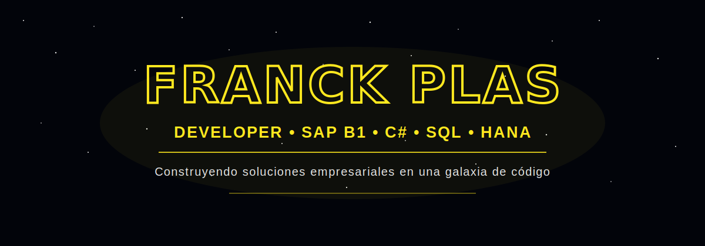

<div align="center">



</div> 

<div align="center">

# 🌌 Bienvenido a mi galaxia de código

### ⚔️ Desarrollador del lado de la fuerza  
### Construyendo soluciones empresariales, automatizaciones y sistemas con propósito

<br>


</div>

## ⚔️ Mi enfoque como desarrollador
<table> <tr> <td align="center" width="120">🧠</td> <td> <b>Análisis</b><br> Antes de desarrollar, busco entender el problema, revisar el proceso real y encontrar la mejor forma de solucionarlo. </td> </tr> <tr> <td align="center">💻</td> <td> <b>Desarrollo</b><br> Construyo aplicaciones, consultas, automatizaciones e integraciones orientadas a mejorar procesos internos. </td> </tr> <tr> <td align="center">🗄️</td> <td> <b>Base de datos</b><br> Trabajo con consultas, validaciones, reportes y análisis de información en SQL Server, SAP HANA y MySQL. </td> </tr> <tr> <td align="center">⚙️</td> <td> <b>Automatización</b><br> Me enfoco en reducir tareas manuales mediante procesos automáticos, integraciones y herramientas internas. </td> </tr> </table>

## 🛸 Identificación de la republica

```txt
Nombre              : Franck Plas
Rol principal       : Desarrollador / Analista de Sistemas
Especialidad        : SAP Business One, C#, SQL y automatización de procesos
Base de operaciones : Perú
Lado de la fuerza   : Backend, datos e integración empresarial
Misión actual       : Crear soluciones estables, útiles y escalables

```
<div align="center">
Lenguajes y desarrollo


<br><br>

Herramientas y bases de datos
 </div> <br> <table align="center"> <tr> <th>Área</th> <th>Tecnologías / Herramientas</th> </tr> <tr> <td>Backend</td> <td>C#, .NET, APIs REST, lógica de negocio</td> </tr> <tr> <td>Base de datos</td> <td>SQL Server, SAP HANA, MySQL</td> </tr> <tr> <td>ERP</td> <td>SAP Business One, DI API, consultas HANA, AddOns</td> </tr> <tr> <td>Frontend</td> <td>HTML, CSS, JavaScript, XAML, WinForms</td> </tr> <tr> <td>Reportería</td> <td>Power BI, Excel, consultas SQL, análisis de datos</td> </tr> <tr> <td>Versionamiento</td> <td>Git, GitHub</td> </tr> </table>

# 🌌 Áreas donde sigo creciendo
```txt
☑ Desarrollo de aplicaciones empresariales
☑ Integración de sistemas mediante APIs
☑ Automatización de procesos internos
☑ Desarrollo con C# y .NET
☑ Consultas avanzadas en SQL Server y SAP HANA
☑ AddOns y personalizaciones para SAP Business One
☑ Diseño de interfaces modernas
☑ Reportes y dashboards con datos empresariales
```

